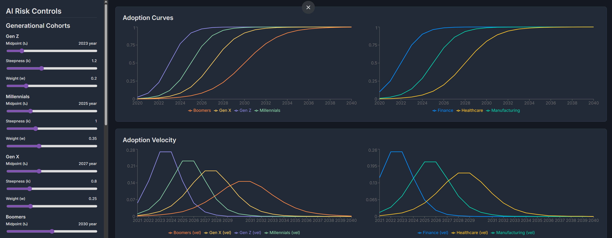

# AI Adoption Risk Advisor Plugin for C42 OS

This is an official plugin for C42 OS. It provides an interactive dashboard to model, visualize, and analyze the complex risks associated with AI adoption across various demographic and industrial cohorts.

The plugin leverages a generative AI model to provide qualitative risk analysis, acting as an expert advisor to help decision-makers understand the potential impacts of their strategies.

---

## Key Features

- **Interactive Scenario Modeling:** Use intuitive sliders to adjust adoption parameters (`t₀`, `k`, `w`) for multiple cohorts in real-time.
- **Multi-Cohort Analysis:** Simultaneously model both Generational (Gen Z, Millennials, etc.) and Industry (Finance, Healthcare, etc.) cohorts.
- **Dynamic Visualization:** Adoption curves, velocity charts, and concentration risk (HHI) are rendered instantly using responsive charts.
- **Advanced Risk Metrics:** Automatically calculates and displays key indicators like Peak HHI, Cascade Vulnerability, Time-to-90% Adoption, and Area Under the Curve (AUC).
- **AI-Powered Analysis:** A "Get AI Analysis" button provides a qualitative risk assessment of the current scenario, generated by an AI model.

---

## How It Works: A C42 OS Plugin

This application is designed from the ground up to function as a first-class citizen within the C42 OS ecosystem. It operates in two modes:

### 1. As a C42 OS Plugin (Integrated Mode)

When loaded inside the C42 OS `iframe`, the plugin automatically detects the environment and uses the `C42_SDK` for all host interactions.

- **Secure AI Calls:** It uses `sdk.request('generate_response', ...)` to ask the C42 Kernel to generate the AI analysis. **The plugin never handles API keys directly**, inheriting the security and credentials of the host OS.
- **Live Theme Syncing:** It uses `sdk.subscribe('theme_change', ...)` to listen for theme changes from the host, instantly switching between light and dark modes to match the user's OS-level preference.

### 2. In Standalone Mode (For Development)

If the `C42_SDK` is not detected, the application gracefully falls back to a standalone mode.

- **Direct API Calls:** It uses the `GoogleGenAI` library directly. This requires an `API_KEY` to be present in the environment variables, intended for local development and testing.
- **System Theme Preference:** It respects the `(prefers-color-scheme: dark)` media query to set its initial theme.

---

## Getting Started

### Inside C42 OS
No installation is needed. Simply open the "AI Risk Advisor" from the Applications menu in C42 OS. The plugin will be loaded and run securely by the Kernel.

### For Local Development
1.  Ensure you have a local web server (e.g., `npx serve`).
2.  Create a `.env` file at the root of the project with your `API_KEY` for the Gemini API if you intend to test the AI analysis feature.
3.  Serve the project's root directory.
4.  Open `index.html` in your browser.

---

## C42 OS Compliance

This plugin is fully compliant with the C42 OS development standards.

- ✅ **SDK Integration:** Built against `C42_SDK` version 2.0. See `SDK_DOCUMENTATION.md`.
- ✅ **Design System:** Implements `C42 OS Unified Design System` version 1.5, including the full light/dark mode color palette. See `DESIGN_SYSTEM.md`.
- ✅ **Security:** Follows the principle of least privilege by delegating sensitive actions (like AI requests) to the Kernel, as outlined in `SECURITY.md`.
- ✅ **Contribution:** Feedback and bug reports should follow the guidelines in the main C42 OS `CONTRIBUTING.md`.

## Tech Stack

- **Framework:** React 19
- **Language:** TypeScript
- **Charting:** Recharts
- **AI Integration:**
    - Google Gemini API (in standalone mode)
    - C42 OS SDK v2.0 (in integrated mode)

C42 OS Proprietary License v1.0

Copyright (c) 2024 [Your Name/Company]

IMPORTANT: This software is proprietary and commercially licensed.

1. GRANT OF RIGHTS
   Subject to the terms of this license, you are granted a non-exclusive, 
   non-transferable right to:
   a) Use this software for personal evaluation purposes only
   b) View and study the source code for educational purposes only

2. RESTRICTIONS
   You may NOT:
   a) Use this software for any commercial purposes
   b) Distribute, sublicense, or sell copies of this software
   c) Modify, adapt, or create derivative works
   d) Remove or alter any proprietary notices
   e) Reverse engineer (except as permitted by law)

3. RESERVATION OF RIGHTS
   All rights not expressly granted are reserved. This includes but is not 
   limited to patents, trademarks, copyrights, and trade secrets.

4. COMMERCIAL LICENSING
   Commercial use requires a separate commercial license. 
   Contact: licensing@c42os.com

5. FUTURE OPEN SOURCE TRANSITION
   The copyright holder reserves the right to release future versions 
   under open source licenses at their sole discretion.

6. NO WARRANTY
   This software is provided "AS IS" without warranty of any kind.

7. LIMITATION OF LIABILITY
   In no event shall the copyright holder be liable for any damages.

8. TERMINATION
   This license terminates automatically if you breach any terms.

For commercial licensing inquiries: licensing@c42os.com
For other questions: legal@c42os.com

This license protects the investment in revolutionary consciousness 
computing research while preserving the option for future open source 
contribution to humanity.
